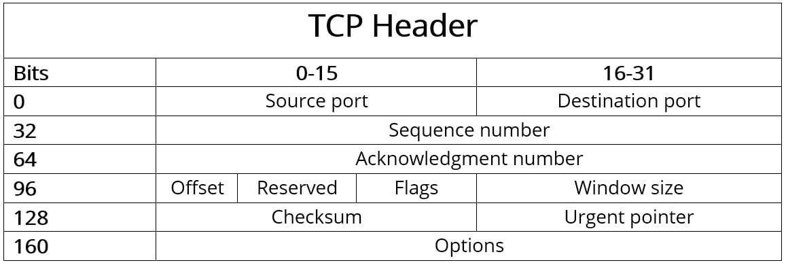
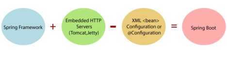
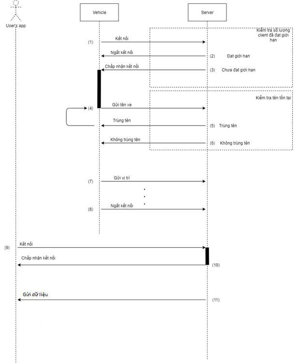

# **LỜI MỞ ĐẦU**

    Công nghệ thông tin trong giai đoạn hiện nay đang phát triển như vũ báo ở mọi
    lĩnh vực hoạt động khắp nơi trên thế giới. Điều xảy ra trong vòng vài năm qua ở
    Việt Nam là sự đầu tư ô ạt vào công nghệ. Tin học đã và đang là một trong các
    vấn đề không thể thiếu đối với bất kỳ công ty nào. Đặc biệt tin học ngày càng
    giữ vai trò quan trọng trong vấn đề quản lý tại các tổ chức nhất là tại các lĩnh
    vực thu thập thông tin. Tuy ngành công nghệ thông tin ở nước ta mới chỉ phát
    triển trong vài năm trở lại đây và đang từng bước phát triển nhưng những bước
    phát triển đó đã cho thấy tiềm năng lớn lao trong lĩnh vực công nghệ thông tin ở
    nước ta, trong đó phát triển hệ thống thông tin đang là thế mạnh của đất nước.
    Hệ thống thông tin giúp công việc quản lý dễ dàng hơn, nâng cao hiệu quả sản
    xuất, tiết kiệm được lượng lớn thời gian và công sức.

    Qua thời gian tìm hiểu thực tế để xác định đề tài thực tập, em nhận thấy nhu cầu
    theo dõi định vị của tất cả mọi thứ nói chung và phương tiện giao thông nói
    riêng đang ngày càng nhiều. Từ đó, chúng ta cần phải có những hệ thống đáp ứng
    những yêu cầu này.

# **GIỚI THIỆU ĐỀ TÀI**

1.1  **Giới thiệu bài toán**

    Việc theo dõi, định vị một hay một nhóm phương tiện giao thông hiện nay đang
    là nhu cầu thiết yếu trong cuộc sống ngày nay. Chúng xuất hiện từ thành thị
    tới nông thôn đặc biệt là các doanh nghiệp kinh doanh vận tải.

    Một ví dụ thực tế là có một doanh nghiệp kinh doanh vận tải. Họ có nhu cầu
    muốn biết các phương tiện vận tải của họ đang ở đâu thì họ phải làm như thế
    nào? Gọi điện trực tiếp cho tài xế, phụ xe? Một giải pháp có vẻ không tốt và
    thực tế cũng chưa chắc chắn được độ chính xác cao. Vậy chúng ta cần có giải
    pháp gì? Cụ thể ra sao?

    Một phương pháp được tôi đề xuất là sử dụng một hệ thống theo dõi các phương
    tiện này dựa trên hạ tầng mạng viễn thông và hệ thống định vị toàn cầu (GPS)
    nhằm gửi thông tin định vị chính xác của các phương tiện theo thời gian thực
    tới người dùng theo thời gian thực.

1.2  **Mục tiêu**

    Mục tiêu của đề tài là thu thập dữ liệu vị trí của các phương tiện giao thông
    theo dõi gửi về máy chủ và thực hiện một số lệnh từ người dùng khi có yêu cầu từ
    người dùng. Để làm được điều đó tôi đã tập trung tìm hiểu một số vấn đề sau:

    -   Tìm hiểu giao thức TCP và nguyên lý hoạt động.

    -   Xây dựng mô hình kết nối và trao đổi dữ liệu giữa máy chủ và máy client.

1.3  **Giới hạn**

    Trong giới hạn bài nghiên cứu này, giá trị vị trí của các client sẽ được tạo ra
    một cách tự động ngẫu nhiên và gửi lên máy chủ. Mọi xử lý dữ liệu sẽ do server
    xử lý.

1.4  **Bố cục của bài báo cáo**

    Phần 1: Giới thiệu đề tài.

    Phần 2: Cơ sở lý thuyết.

    Phần 3: Xây dựng ứng dụng theo dõi phương tiện giao thông.

    

# **CƠ SỞ LÝ THUYẾT**

1.5  **Định nghĩa về giao thức TCP/IP**

    Bộ giao thức TCP/IP (TCP/IP protocol suite) hay còn gọi là bộ giao thức Internet
    (tiếng Anh: Internet protocol suite hoặc IP suite) là một mô hình khái niệm
    (conceptual model) và một tập hợp các giao thức truyền thông dùng trong mạng
    Internet và các hệ thống mạng máy tính tương tự. Tên gọi TCP/IP đến từ hai giao
    thức nền tảng của bộ giao thức là TCP (Transmission Control Protocol) và IP
    (Internet Protocol). TCP và IP cũng là hai giao thức đầu tiên được định nghĩa.

    Như nhiều bộ giao thức khác, bộ giao thức TCP/IP có thể được coi là một tập hợp
    các tầng, mỗi tầng giải quyết một tập các vấn đề có liên quan đến việc truyền dữ
    liệu, và cung cấp cho các giao thức tầng cấp trên một dịch vụ được định nghĩa rõ
    ràng dựa trên việc sử dụng các dịch vụ của các tầng thấp hơn. Về mặt logic, các
    tầng trên gần với người dùng hơn và làm việc với dữ liệu trừu tượng hơn, chúng
    dựa vào các giao thức tầng cấp dưới để biến đổi dữ liệu thành các dạng mà cuối
    cùng có thể được truyền đi một cách vật lý.

    Mô hình OSI miêu tả một tập gồm 7 tầng mà một số nhà sản xuất lựa chọn và nó có
    thể được so sánh tương đối với các bộ giao thức TCP/IP. Sự so sánh này có thể
    gây nhầm lẫn hoặc mang lại sự hiểu biết sâu hơn về bộ giao thức TCP/IP.

1.6  **Các tầng trong chồng giao thức của bộ giao thức TCP/IP**

    Bộ giao thức IP dùng sự đóng gói dữ liệu nhằm trừu tượng hóa (thu nhỏ quan niệm
    cho dễ hiểu) các giao thức và các dịch vụ. Nói một cách chung chung, giao thức ở
    tầng thấp hơn để đạt được mục đích của mình. Chồng giao thức Internet gần giống
    như các tầng cấp trong mô hình Bộ quốc phòng Mỹ:

    -   Tầng ứng dụng: Các giao thức định tuyến như BGP và RIP, vì một số lý do,
        chạy trên TCP và UDP – theo thứ tự từng cặp: BGP dùng TCP, RIP dùng UDP –
        còn có thể được coi là một phần của tầng ứng dụng hoặc tầng mạng.

    -   Tầng giao vận: Các giao thức định tuyến như OSPF
        (tuyến ngắn nhất được chọn đầu tiên), chạy trên IP, cũng có thể được coi là
        một phần của tầng giao vận  hoặc tầng mạng.ICM (Internet control message 
        protocol - tạm dịch là Giao thức điều khiển thông điệp Internet) và IGMP
        (Internet group management protocol - tạm dịch là Giao thức quản lý nhóm
        Internet) chạy trên IP, có thể được coi là một phần của tầng mạng
    -   Tầng mạng: ARP(Address Resolution Protocol - tạm dịch là Giao thức phân giải 
        địa chỉ) và RARP (Reverse Address Resolution Protocol - tạm dịch là Giao thức tìm 
        địa chỉ ngược lại) hoạt động ở bên dưới IP nhưng ở trên tầng liên kết (link layer), 
        vậy có thể nói là nó nằm ở khoảng trung gian giữa hai tầng.

    -   Tầng liên kết: Những tầng gần trên nóc gần với người sử dụng hơn, còn những
        tầng gần đáy gần với thiết bị truyền thông dữ liệu. Mỗi tầng có một [giao
        thức để phục vụ tầng trên nó, và một [giao thức để sử dụng dịch vụ của tầng dưới
        nó (ngoại trừ giao thức của tầng đỉnh và tầng đáy).

   

   Mô hình kết nối 2 bộ định tuyến thông qua các lớp tương ứng

    Những tầng gần trên nóc gần với người sử dụng hơn, còn những tầng gần đáy gần
    với thiết bị truyền thông dữ liệu. Mỗi tầng có một giao thức để phục vụ tầng
    trên nó, và một giao thức để sử dụng dịch vụ của tầng dướinó (ngoại trừ giao thức 
    của tầng đỉnh và tầng đáy).

    Cách nhìn các tầng cấp theo quan niệm: hoặc là cung cấp dịch vụ, hoặc là sử dụng
    dịch vụ, là một phương pháp trừu tượng
    hóa để cô lập các giao thức của tầng trên, tránh quan tâm đến thực chất của vấn đề,
    như việc truyền tải từng bit qua Ethernet chẳng hạn, và phát hiện xung
    đột (collision detection), trong khi những tầng dưới không cần phải biết đến chi
    tiết của mỗi một chương trình ứng dụng và giao thức của nó.

  

  Mối tương quan giữa mô hình OSI và mô hình TCP/IP

    Sự trừu tượng hóa này cho phép những tầng trên cung cấp những dịch vụ mà các tầng dưới không thể làm được,
    hoặc cố ý không làm. Chẳng hạn IP được thiết kế với độ đáng tin cậy thấp, và
    được gọi là giao thức phân phát với khả năng tốt
    nhất(thay vì với "độ tin cậy cao" hoặc "đảm bảo nhất"). Điều đó có nghĩa là tất cả
    các tầng giao vận đều phải lựa chọn, hoặc là cung cấp dịch vụ đáng tin cậy, hoặc là không, và ở
    mức độ nào. UDP đảm bảo sự toàn vẹn của dữ liệu (bằng cách dùng kiểm tra
    tổng(checksum), song không đảm bảo sự phân phát dữ liệu tới đích; TCP cung cấp cả
    hai, sự toàn vẹn của dữ liệu, và đảm bảo sự phân phát dữ liệu tới đích (bằng
    cách truyền tải lại gói dữ liệu, cho đến khi nơi nhận nhận được gói dữ liệu).

  

1.7  **Cách TCP hoạt động**

    TCP cho phép truyền thông tin theo cả hai hướng. Điều này có nghĩa là các hệ
    thống máy tính giao tiếp qua TCP có thể gửi và nhận dữ liệu cùng một lúc, tương
    tự như một cuộc trò chuyện qua điện thoại. Giao thức sử dụng các phân đoạn (gói
    tin) làm đơn vị truyền dữ liệu cơ bản. Ngoài tải trọng, các phân đoạn cũng có
    thể chứa thông tin điều khiển và được giới hạn ở 1.500 byte. Phần mềm TCP trong
    ngăn xếp giao thức mạng của hệ điều hành chịu trách nhiệm thiết lập và kết thúc
    các kết nối đầu cuối cũng như truyền dữ liệu.

    Phần mềm TCP được điều khiển bởi các ứng dụng mạng khác nhau, chẳng hạn như
    trình duyệt web hoặc máy chủ, thông qua các giao diện cụ thể. Mỗi kết nối phải
    luôn được xác định bởi hai điểm cuối được xác định rõ ràng (máy khách và máy
    chủ). Không quan trọng bên nào đảm nhận vai trò khách hàng và bên nào đảm nhận
    vai trò máy chủ. Tất cả những gì quan trọng là phần mềm TCP được cung cấp một
    cặp duy nhất, có thứ tự bao gồm địa chỉ IP và cổng (còn được gọi là "2-tuple"
    hoặc "socket") cho mỗi điểm cuối.

**Bắt tay ba bước: Cách thiết lập kết nối TCP chi tiết**

    Điều kiện tiên quyết để thiết lập kết nối TCP hợp lệ: Cả hai thiết bị đầu cuối
    phải có một địa chỉ IP duy nhất (IPv4 hoặc IPv6) và đã gán và kích hoạt cổng
    mong muốn để truyền dữ liệu. Địa chỉ IP đóng vai trò là mã định danh, trong khi
    cổng cho phép hệ điều hành chỉ định kết nối cho các ứng dụng máy khách và máy
    chủ cụ thể.

    1.Đầu tiên, máy khách yêu cầu gửi cho máy chủ một gói hoặc phân đoạn SYN (SYN là
    viết tắt của đồng bộ hóa) với một số ngẫu nhiên, duy nhất. Số này đảm bảo truyền
    đầy đủ theo đúng thứ tự (không trùng lặp).

    2\. Nếu máy chủ đã nhận được phân đoạn, nó đồng ý với kết nối bằng cách trả về
    gói SYN-ACK (ACK là viết tắt của xác nhận) bao gồm chuỗi số của máy khách cộng
    với 1. Nó cũng truyền chuỗi số của chính nó tới máy khách.

    3\. Cuối cùng, máy khách xác nhận việc nhận phân đoạn SYN-ACK bằng cách gửi gói
    ACK của chính nó, trong trường hợp này chứa chuỗi số của máy chủ cộng với 1.
    Đồng thời, máy khách đã có thể bắt đầu truyền dữ liệu đến máy chủ.

   
    Quá trình thiết lập một kết nối TCP(Bắt tay ba bước)

   **Cách kiểm soát kết thúc một kết nối TCP**

    Cả hai phía của kết nối đều có thể chấm dứt kết nối TCP và thậm chí có thể chấm
    dứt một phía. Đây còn được gọi là kết nối nửa mở, theo đó phía bên kia vẫn được
    phép truyền dữ liệu ngay cả khi một bên đã ngắt kết nối.

    Các bước riêng lẻ của kết thúc hai chiều (do client bắt đầu) có thể được tóm tắt
    như sau:

    1\. Máy khách (client) gửi một phân đoạn FIN để thông báo cho máy chủ (server)
    rằng nó không muốn gửi dữ liệu nữa. Nó gửi chuỗi số của chính nó, giống như khi
    kết nối được thiết lập.

    2\. Máy chủ xác nhận đã nhận gói có phân đoạn ACK chứa chuỗi số cộng với 1.

    3\. Khi máy chủ kết thúc quá trình truyền dữ liệu, nó cũng sẽ gửi một gói FIN,
    gói này sẽ thêm chuỗi số của nó.

    4\. Bây giờ đến lượt máy khách gửi một gói ACK bao gồm chuỗi số cộng với 1, gói
    này chính thức chấm dứt kết nối TCP cho máy chủ.

   
    Quá trình kết thúc một kết nối TCP

1.8  **Cấu trúc header của một kết nối TCP**

    Thông thường, tiêu đề của gói TCP chứa dữ liệu cần thiết để kết nối và truyền dữ
    liệu với Transmission Control Protocol (Giao thức điều khiển truyền). Dữ liệu
    header này (chứa thông tin điều khiển) đứng trước trọng tải được truyền và
    thường có kích thước 20 byte (160 bit). Theo sau là thông tin bổ sung lên đến 40
    byte (320 bit), là tùy chọn và không được sử dụng trong tất cả các gói.

  
  Cấu trúc của một TCP header

    Các thành phần hoặc trường riêng lẻ của tiêu đề của giao thức TCP có ý nghĩa
    sau:

    -   Source port (16 bit): Xác định số cổng của người gửi.

    -   Destination port(16 bit): Xác định số cổng của người nhận.

    -   Sequence number (32 bit): Chuỗi số chỉ định byte đầu tiên của dữ liệu
        trọng tải được đính kèm hoặc được gửi khi kết nối được thiết lập hoặc chấm
        dứt. Nó cũng được sử dụng để xác nhận và sắp xếp các phân đoạn sau khi
        truyền.

    -   Acknowledgment number (32 bit): Trường này chứa số thứ tự tiếp theo mà
        người gửi đang mong đợi. Cờ ACK (trong trường “Cờ”) là điều kiện tiên quyết
        để có hiệu lực.

    -   Offset (4 bits): Trường “Offset” chỉ định độ dài của tiêu đề TCP bằng
        các từ 32 bit để đánh dấu điểm bắt đầu của dữ liệu trọng tải. Điểm bắt đầu
        này thay đổi giữa các phân đoạn do trường "Options" có thể thay đổi.

    -   Reserved (6 bit): Được dự trữ để sử dụng trong tương lai theo RFC 793 và
        chưa được sử dụng. Trường này phải luôn được đặt thành 0.

    -   Flags (6 bit): Sáu bit đơn có thể có trong trường “Flags” cho phép các hành
        động TCP khác nhau để tổ chức giao tiếp và xử lý dữ liệu. Các cờ sau được
        đặt hoặc không được đặt cho các hành động này:

    -   URG: Cờ "Urgent" báo hiệu cho ứng dụng TCP rằng dữ liệu tải trọng phải được
        xử lý ngay lập tức tới con trỏ Khẩn cấp đã đặt (xem ở trên).

    -   ACK: Kết hợp với số báo nhận, cờ ACK xác nhận việc nhận các gói TCP. Nếu cờ
        không được đặt, số xác nhận cũng không hợp lệ.

    -   PSH: Cờ "Push" đảm bảo rằng một phân đoạn TCP ngay lập tức được đẩy qua mà
        không được gửi trước đến bộ đệm của người gửi và người nhận.

    -   RST: Nếu có lỗi trong quá trình truyền, gói TCP có cờ RST được gán có thể
        được sử dụng để thiết lập lại kết nối.

    -   SYN: Các tin nhắn có cờ SYN đại diện cho bước đầu tiên của quá trình bắt tay
        ba bước, nghĩa là chúng bắt đầu kết nối.

    -   FIN: Cờ "Finish" báo hiệu cho bên kia rằng người gửi đang kết thúc quá trình
        truyền.

    -   Window size (16 bit): Trường này chỉ định số byte mà người gửi sẵn sàng
        nhận.

    -   Checksum (16 bit): Giao thức điều khiển truyền có thể phát hiện lỗi truyền
        một cách đáng tin cậy. Tổng kiểm tra được tính toán từ header, dữ liệu trọng
        tải và pseudo-header được sử dụng cho mục đích này.

    -   Urgent Pointer (16 bit): Con trỏ khẩn cấp cho biết vị trí của byte đầu tiên
        sau dữ liệu trọng tải cần được xử lý khẩn cấp. Do đó, trường này chỉ hợp lệ
        và phù hợp nếu cờ URG được gán.

    -   Options (0 - 320 bit): Sử dụng trường Options nếu bạn muốn bao gồm các hàm
        TCP không thuộc header chung, ví dụ: nếu bạn muốn xác định kích thước phân
        đoạn tối đa. Độ dài của các tùy chọn phải luôn là bội số của 32, nếu không
        thì bắt buộc phải có đệm bit 0.

1.8  **Sự khác nhau giữa giao thức TCP/IP và IP**

    Có rất nhiều sự khác biệt giữa giao thức TCP/IP và IP. Ví dụ, IP là một giao
    thức internet cấp thấp tạo điều kiện cho việc truyền dữ liệu qua internet. Mục
    đích của nó là cung cấp các gói dữ liệu bao gồm các header, chứa các thông tin
    định tuyến, đơn cử là nguồn – đích của dữ liệu và độ lớn của dữ liệu.

    Giao thức IP bị giới hạn bởi số lượng dữ liệu mà nó có thể gửi. Kích thước tối
    đa của một gói dữ liệu IP chứa cả header và data dài từ 20 đến 24 byte. Điều này
    có nghĩa là chuỗi dữ liệu dài hơn phải được chia thành nhiều gói dữ liệu gửi một
    cách độc lập và sau đó được tổ chức lại theo đúng thứ tự sau khi chúng đã gửi
    đi.

    Vì giao thức IP hoàn toàn là một giao thức gửi và nhận dữ liệu nên không có tính
    năng kiểm tra tích năng kiểm tra tích hợp nào xác minh xem các gói dữ liệu được
    gửi có thực sự nhận được hay không.

    Ngược lại với giao thức IP, TCP/IP là một giao thức truyền thông thông minh hơn,
    có thể làm được nhiều việc hơn. Giao thức TCP/IP vẫn sử dụng IP như một phương
    tiện vận chuyển các gói dữ liệu, nhưng nó cũng có kết nối với máy tính, ứng
    dụng, trang web và máy chủ web. TCP hiểu một cách tổng thể là toàn bộ luồng dữ
    liệu mà các nội dung này yêu cầu để hoạt động và nó đảm bảo toàn bộ khối lượng
    dữ liệu cần thiết được gửi trong lần đầu. TCP cũng chạy các kiểm tra nhằm đảm
    bảo rằng dữ liệu đã được nhận.

    Khi TCP hoạt động, nó cũng có thể kiểm soát kích thước và tốc độ truyền các dòng
    dữ liệu. Nó đảm bảo rằng các mạng không bị tắt nghẽn có thể cản trở việc truyền
    nhận dữ liệu.

    Một ví dụ rằng một ứng dụng muốn gửi một lượng lớn dữ liệu qua internet. Nếu ứng
    dụng chỉ sử dụng IP, dữ liệu sẽ phải được chia thành nhiều gói IP. Điều này sẽ
    yêu cầu nhiều yêu cầu gửi và nhận dữ liệu, vì các yêu cầu IP được cấp cho mỗi
    gói.

    Với TCP, chỉ cần một yêu cầu duy nhất để gửi toàn bộ luồng dữ liệu; TCP xử lý
    phần còn lại. Không giống như IP, TCP có thể phát hiện các vấn đề phát sinh
    trong IP và yêu cầu truyền lại bất kỳ gói dữ liệu nào bị mất. TCP cũng có thể tổ
    chức lại các gói để chúng được truyền theo thứ tự thích hợp - và nó có thể giảm
    thiểu tắc nghẽn mạng. TCP/IP giúp truyền dữ liệu qua internet dễ dàng hơn.

1.9  **Hệ quản trị cơ sở dữ liệu Microsoft SQL Server**

Logo MSSQL

    SQL Server là một hệ quản trị cơ sở dữ liệu quan hệ (Relational Database Management System (RDBMS) ) sử dụng
    câu lệnh SQL (**Transact-SQL)** để trao đổi dữ liệu giữa máy Client và máy cài
    SQL Server. Một RDBMS bao gồm databases, database engine và các ứng dụng dùng để
    quản lý dữ liệu và các bộ phận khác nhau trong RDBMS.

  

Các tính năng của MSSQL
    SQL Server được cấu tạo bởi nhiều thành phần như Database Engine, Reporting Services, Notification Services,
    Integration Services, Full Text Search Service…. Các thành phần này khi phối hợp
    với nhau tạo thành một giải pháp hoàn chỉnh giúp cho việc lưu trữ và phân tích
    dữ liệu một cách dễ dàng.

  

1.10  **Giới thiệu về Spring Boot**

    Spring Boot là một dự án phát triển bởi JAV (ngôn ngữ java) trong hệ sinh thái
    Spring framework. Nó giúp cho các lập trình viên chúng ta đơn giản hóa quá trình
    lập trình một ứng dụng với Spring, chỉ tập trung vào việc phát triển business
    cho ứng dụng.

    Dưới đây là một số tính năng nổi bật của Spring Boot:

    -   Tạo các ứng dụng Spring độc lập.

    -   Nhúng trực tiếp Tomcat, Jetty hoặc Undertow (không cần phải deploy ra file
        WAR) . Các starter dependency giúp việc cấu hình Maven đơn giản hơn.

    -   Tự động cấu hình Spring khi cần thiết
    -   Không sinh code cấu hình và không yêu cầu phải cấu hình bằng XML …

 
 Mô hình Spring Boot
    

  

# **XÂY DỰNG ỨNG DỤNG THEO DÕI PHƯƠNG TIỆN GIAO THÔNG**

1.11  **Yêu cầu, mục đích của mô hình**

    Xây dựng, triển khai các dịch vụ phụ trợ cho người dùng cuối và quản trị viên.

    Kiểm tra, đánh giá mô hình nhằm đảm bảo tính chính xác và chất lượng.

1.12  **Giao thức xây dựng mô hình**

    Với mô hình client-server ta có 2 giao thức phổ biến trong socket programming:
    TCP và UDP.

Quá trình thiết lập kết nối và truyền dữ liệu giao thức TCP

    Với TCP các headers của nó có giá trị 20 byte hỗ trợ nhiều tính năng hữu ích (trong đó có khả năng khôi
    phục lỗi). Khi dữ liệu bắt đầu truyền, TCP sẽ thiết lập kết nối 2 máy gửi và
    nhận theo nguyên tắc “bắt tay ba bước” nhờ đó đảm bảo các gói tin được gửi một
    cách đầy đủ và chính xác. Nếu có gói tin bị mất, sẽ được yêu cầu gửi lại. Lợi
    thế của TCP là truyền dữ liệu đáng tin cậy hơn UDP nhưng lại chậm hơn so với
    UDP.

  

 
  Độ trễ của giao thức TCP và UDP
  
     Với UDP nó hoạt động theo hướng không kết nối giữa máy gửi và máy nhận, các headers của nó có giá trị 8 byte nên
    hỗ trợ tính năng hơn so với TCP. Lợi thế của UDP là truyền dữ liệu nhanh hơn do
    cơ chế hoạt động đơn giản tuy nhiên không đáng tin cậy bằng TCP.

    Dựa vào yêu cầu bài toán đặt ra là theo dõi các phương tiện giao thông ta cần
    đảm bảo các thông tin sau đây:

    -   Tính tức thời (Độ trễ thấp) nhằm hiển thị tức thời vị trí của phương tiện.

    -   Tính chính xác cao và ít thất thoát dữ liệu.

    -   Có khả năng xử lý cùng lúc nhiều phương tiện (clients).

    Với các nhu cầu trên ta sẽ lựa chọn giao thức TCP bởi các khả năng tin cậy cao
    và độ trễ ở mức chấp nhận được.

1.13  **Mô hình Client – Server của ứng dụng**

    Từ nhu cầu thực tế ta xác định được các đối tượng sau:

    -   Khối xử lý dữ liệu.

    -   Khối khởi tạo các vị trí (giả lập).

    -   Khối giao diện người dùng.

    -   Khối viết log.

Mô hình Client – Server và ứng dụng

Lược đồ cộng tác của hệ thống

1.14  **Xây dựng ứng dụng**

    Ứng dụng sẽ có 3 thành phần chính như sau:

    -   Thành phần Client: bao gồm các bộ giả lập định vị của các phương tiện giao
        thông và ứng dụng theo dõi phương tiện của người dùng.

    -   Thành phần Server: nơi lưu trữ dữ liệu, điều khiển và kết nối các thành phần
        của hệ thống.

1.15  **Giả lập định vị của phương tiện giao thông**

    Nhiệm vụ: Thành phần đảm nhận việc sinh ra định vị một các ngẫu nhiên và gửi
    cho Server xử lý.

    Các khối thành phần: bao gồm các client giả lập vị trí của các phương tiện
    giao thông. Mỗi khối đại diện cho 1 phương tiện.

    Ngôn ngữ lập trình: C++.

    Quá trình hoạt động:

    -   Khi thành phần này khởi chạy nó sẽ gửi yêu cầu kết nối đến Server.

    -   Khi nhận được sự chấp thuận của Server sẽ tiến hành gửi tên thiết bị cho
        Server (thường là biển kiểm soát).

    -   Nếu tên không trùng Server sẽ gửi tín hiệu chấp thuận tên thiết bị và tiến
        hành gửi định vị của thiết bị được tạo ra ngẫu nhiên sau mỗi 2s. Nếu tên
        không được chấp thuận thì phải điều chỉnh tên và gửi lại cho Server.

1.16  **Ứng dụng theo dõi phương tiện giao thông cho người dùng**

    Nhiệm vụ: Nhận dữ liệu liên quan bao gồm các phương tiện giao thông, thông
    tin người dùng từ Server và hiển thị vị trí trên bản đồ theo phương tiện,
    thông tin phương tiện mà người dùng cần quản lý, theo dõi.

    Các khối thành phần:

    -   Receive Data: Nhận các thông tin thay đổi định vị của các phương tiện giao
        thông (kể cả thông tin ngắt kết nối từ phương tiện) từ Server, các thông tin
        của phương tiện, người dùng. Lấy dữ liệu liên quan từ Server thông qua API
        Service.

    -   Map UI: Hiển thị giao diện bản đồ và hiển thị định vị tương ứng mà người
        dùng chọn theo dõi và các thông tin liên quan.

        Ngôn ngữ lập trình: Java.

        Quá trình hoạt động:

    -   Khi thành phần này hoạt động nó sẽ gửi yêu cầu kết nối đến Server và nhận dữ
        liệu thông qua API Service.

    -   Khi nhận được dữ liệu từ Server sẽ tiến hành hiển thị dữ liệu tương ứng
        thông qua giao diện của ứng dụng.

    -   Khi người dùng lựa chọn phương tiện, ứng dụng sẽ hiển thị vị trí tương ứng
        với vị trí mà ứng dụng nhận được. Nếu phương tiện mà người dùng theo dõi bị
        mất kết nối, ứng dụng sẽ gửi thông báo phương tiện ngắt kết nối đến người
        dùng và hiển thị vị trí cuối cùng mà ứng dụng nhận được.

1.17  **Server lưu trữ tạm thời và trao đổi dữ liệu**

    Nhiệm vụ: Chấp nhận các kết nối từ các giả lập vị trí các phương tiện giao
    thông (nếu chưa đạt giới hạn) và chấp nhận các kết nối của ứng dụng theo dõi
    từ người dùng. Kiểm tra tên thiết bị của các ứng dụng giả lập vị trí; lưu vị
    trí của phương tiện vào cơ sở dữ liệu; gửi định vị của các phương tiện nếu
    có sự thay đổi cho ứng dụng theo dõi vị trí của người dùng.

    Các thành phần:

    -   API Service: phụ trách gửi thông tin định vị của phương tiện nếu có sự thay
        đổi đến ứng dụng theo dõi của người dùng. Đồng thời gửi dữ liệu cần thiết
        đến thiết bị và trao đổi dữ liệu (thêm/xóa/sửa/truy vấn) với cơ sở dữ liệu.

    -   Receive Coord: nhận các thông tin thay đổi định vị từ các phương tiện giao
        thông nếu có sự thay đổi từ các thành phần giả lập định vị của phương tiện
        giao thông.

        Ngôn ngữ lập trình: Java.

        Quá trình hoạt động:

    -   Khi thành phần này bắt đầu, nó sẽ mở hai socket tại cổng đã được định sẵn và
        lắng nghe kết nối từ các thành phần khác.

    -   Khi có yêu cầu kết nối, nếu yêu cầu kết nối là thành phần giả lập nó sẽ kiểm
        tra số lượng các phương tiện đã đạt giới hạn hay chưa, nếu chưa nó sẽ gửi
        tín hiệu chấp nhận, ngược lại sẽ gửi tín hiệu không chấp nhận. Nếu yêu cầu
        kết nối là thành phần ứng dụng theo dõi của người dùng, nó sẽ kiểm tra đã có
        ứng dụng của người dùng nào kết nối đến Server hay chưa, nếu chưa nó sẽ gửi
        tín hiệu chấp thuận, ngược lại nó sẽ gửi tín hiệu không chấp thuận. Nếu yêu
        cầu đến từ thành phần ứng dụng của người dùng nó sẽ kiểm tra tính xác thực
        của truy vấn và trả dữ liệu.

    -   Server lắng nghe các thành phần giả lập vị trí của phương tiện giao thông,
        cụ thể là lắng nghe sự thay đổi vị trí của các phương tiện, nếu có sự thay
        đổi Server sẽ gửi sự thay đổi này đến cơ sở dữ liệu và cập nhật trạng thái
        (kể cả việc phương tiện ngắt kết nối đến Server).

1.18  **Cơ sở dữ liệu**

    Nhiệm vụ: Cung cấp dữ liệu cho toàn bộ hệ thống. Lưu trữ và hỗ trợ truy vấn từ
    Server.

# **PHỤ LỤC**

**Link source code**

**Ứng dụng theo dõi phương tiện giao thông của người dùng**

<https://github.com/vanthanhnguyen99/TrackingVehicle>

**Giả lập phương tiện giao thông**

<https://github.com/vanthanhnguyen99/VehicleSimulator/>

**Serer nhận và trao đổi dữ liệu**

https://github.com/vanthanhnguyen99/VehicleTrackingServer
